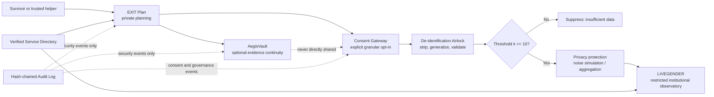
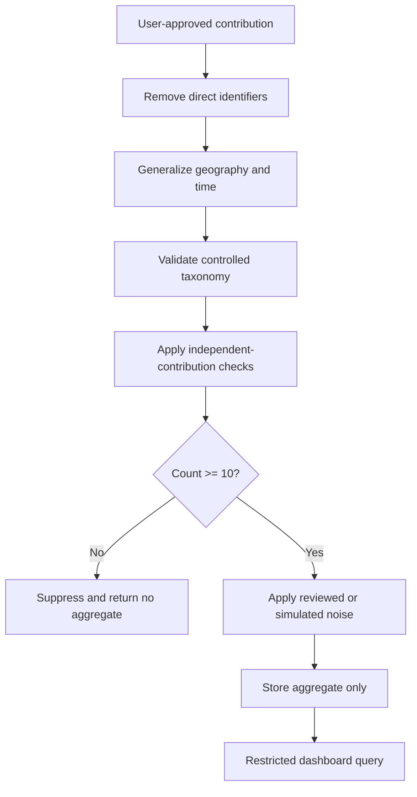

# EXIT — Technical Documentation

**Version:** 1.0 — Hackathon Prototype

**Author:** Manus AI

**Status:** India-first prototype with a globally extensible architecture

## 1. Executive Summary

EXIT is a **survivor-owned safety-continuity platform** that helps women prepare privately for safety, independence, support, and—where safe—evidence continuity. It is intentionally not a generic SOS app, police-dispatch tool, crime-reporting substitute, danger-score engine, abuser-detection system, surveillance platform, public unsafe-places map, or system that tells a person to leave immediately.

The platform consists of three deliberately separated modules:

| Module | Primary user | Purpose | Data boundary |
|---|---|---|---|
| **EXIT Plan** | Survivor or trusted helper | Private safety and independence planning | Private, user-controlled plan data |
| **AegisVault** | Survivor | Optional evidence continuity and digital-safety support | Separate encrypted evidence store |
| **LIVEGENDER** | Verified institutions | Privacy-preserving aggregate service-demand trends | De-identified, threshold-protected aggregates only |

The non-negotiable data rule is:

> **Private survivor data is never observatory data.** LIVEGENDER must never read private plans, evidence, exact locations, names, account handles, user IDs, or free-text stories. [1]

The intended end-to-end flow is one-directional:



This document consolidates the product requirements, technical design, federated data-mesh architecture, API boundaries, security model, ethics framework, SDG alignment, demo flow, and implementation roadmap contained in the supplied EXIT project brief. [1]

## 2. Scope, Assumptions, and Maturity

The hackathon implementation should be an **India-first demonstrator** using fictional persona data and synthetic institutional data. The architecture should visibly support future country and regional sovereignty, but the prototype must not claim production-grade legal compliance, forensic evidence certification, differential privacy, or live partner integration.

| Area | Prototype position | Production requirement |
|---|---|---|
| User data | Fictional or synthetic data only | Survivor-validated safeguarding and jurisdictional compliance |
| Evidence integrity | SHA-256 hash and tamper-evident metadata | Independent forensic and legal review; secure key management |
| Privacy noise | Simulated and clearly labelled | Calibrated, reviewed differential-privacy mechanism |
| Deployment | Local or Docker-based demo | Region-local sovereign nodes and independent security operations |
| Service directory | Seeded verified-style or official-style records | Continuous human verification and partner accountability |
| AI | Optional rewriting and demo classification | Human-reviewed, bounded, auditable use only |

The system must use honest labels such as **synthetic data**, **prototype**, **simulated privacy protection**, and **not legal advice** wherever applicable.

## 3. Product Requirements

### 3.1 EXIT Plan

EXIT Plan must allow a user to begin without an account, identity disclosure, proof submission, GPS permission, police contact, or forced evidence collection. The onboarding sequence is:

1. Device and communication safety check.
2. Need-category selection.
3. Categorical readiness snapshot.
4. Transparent action-plan generation.
5. Optional service-directory routing.
6. Optional AegisVault path.
7. Separate consent gateway for any aggregate contribution.

The interface must use categorical statuses such as **Prepared**, **Partially prepared**, **Needs attention**, and **Not yet planned**. It must never display a numeric safety score or imply that the platform predicts danger.

The flagship **If I Leave Tomorrow** simulator accepts country, region, broad location, dependents, money access, documents, employment, accommodation, transport, health or disability needs, support network, phone safety, digital account control, and requested service categories. It produces optional 24-hour, 72-hour, and seven-day preparation plans, a readiness snapshot, a personalized service map, a private checklist, and an optional user-approved checklist for a trusted contact.

### 3.2 Explainable Rules Engine

High-stakes recommendations are generated by deterministic, reviewable rules rather than predictive AI.

| Need or condition | Triggered action | Priority |
|---|---|---:|
| Phone or email may be monitored | Choose a safer communication method and review quiet mode | 1 |
| No trusted contact selected | Identify one trusted person if safe | 2 |
| Documents unavailable | Create a document-access checklist and show legal/identity support pathways | 3 |
| No accommodation plan | Explore temporary accommodation and verified support resources | 4 |
| No transport fallback | Prepare alternative transport options | 5 |
| Limited emergency funds | Review independent financial-access options | 6 |
| Dependents selected | Build child/dependent essentials plan | 7 |
| Shared digital access | Review account, device, recovery, and location-sharing safety | 8 |
| Cyber abuse selected | Offer optional evidence continuity, with safety warning | 9 |
| Legal or counselling need selected | Route to verified service categories | 10 |

Every generated action must show its reason, allow user review, and remain private unless the user explicitly shares it.

### 3.3 AegisVault

AegisVault is optional and user-controlled. It supports evidence capsules containing screenshots, photos, videos, voice notes, PDFs, URLs, social handles, platform names, incident notes, date ranges, witness notes, and controlled harm categories. For every item the system records a file ID, SHA-256 hash, upload timestamp, media type, selected category, and metadata warning.

AegisVault provides a private chronological timeline and user-controlled sharing states: private, selected for export, shared with a named recipient, revoked, or expired. Sharing must use short-lived signed links, explicit recipient selection, revocation, expiry, and access logging. No person or institution has default access.

Required limitation copy:

> AegisVault provides tamper-evident evidence continuity after saving an item. It does not certify evidence, guarantee legal admissibility, guarantee takedown, or replace professional digital forensics. [1]

The deepfake and impersonation workflow must label content as **suspected manipulated media** or **suspected impersonation**. It must capture the platform, handle, URL, screenshot, upload time, user description, takedown checklist, support pathway, and user-reviewed export. It must never claim automatic certainty.

### 3.4 LIVEGENDER

LIVEGENDER is a restricted observatory for verified NGOs, survivor-support organizations, research units, public-health planners, legal-aid networks, and approved public-service coordination bodies. Access must not be granted to advertisers, employers, insurers, data brokers, unverified police users, political parties, random public users, or anyone seeking survivor or suspect identification.

LIVEGENDER measures only **voluntary, de-identified, threshold-protected help-seeking signals**. It does not measure true prevalence, verified crime rates, perpetrator behaviour, individual risk, unsafe neighbourhoods, causal online/offline links, or whether a report is true.

The controlled taxonomy includes cyberstalking, doxxing, impersonation, image-based abuse, suspected AI-manipulated abuse, sextortion, online harassment, account coercion, coordinated digital attacks, digital financial coercion, location-tracking abuse, and child/dependent-related digital coercion.

## 4. Consent Gateway and Data Flow

The default consent state is **Keep everything private**. A user may separately choose category only; category plus country; category plus broad city/district; category plus broad week/month; or no contribution. Withdrawal of future contributions must be available.

Recommended consent copy:

> Would you like to anonymously share only a broad category of experience, broad city/district, and week/month to help support organizations understand service needs? Your safety plan, identity, exact location, evidence, phone number, account information, and private notes will not be shared. You can use EXIT even if you choose no. [1]

A consent record contains a consent-version identifier, accepted fields, timestamp, purpose, retention period, aggregation state, and withdrawal state. Consent is independent from plan creation and independent from evidence storage.

### 4.1 De-identification Pipeline



Allowed fields are controlled harm category, broad country, safe state/province, broad city/district, week/month bucket, optional broad age band, optional service need, and source provenance. Forbidden fields include names, phone numbers, email addresses, addresses, GPS, photographs, video, audio, screenshots, free text, account links, device identifiers, IP addresses, evidence hashes, user IDs, trusted contacts, shelter locations, employer/school/workplace names, and alleged perpetrator information.

The minimum threshold is **k ≥ 10**. Any locality/category/time result below that threshold must display: **Insufficient data to display safely.** Weekly data is restricted to governed dashboards; public summaries should use monthly or broader periods. Exact day and time data is forbidden.

## 5. Federated Data Mesh and Database Architecture

EXIT must use a **federated data mesh of sovereign, independently secured nodes**, not a peer-to-peer or blockchain-replicated database. Replication and immutable personal records conflict with the survivor’s right to delete. The audit log may be append-only and hash-chained, but personal and evidence data must remain deletable.

### 5.1 Node Separation

| Node | Stores | Encryption domain | Allowed access |
|---|---|---|---|
| EXIT Plan node | Readiness inputs, private action plans, local preferences | Independent plan key hierarchy | User/session only |
| AegisVault node | Evidence objects and metadata | Independent vault key hierarchy | User and explicit recipient grants |
| Consent node | Consent versions, fields, withdrawals, receipts | Independent consent key hierarchy | User and audited consent service |
| Service Directory node | Verified service records | Directory key hierarchy | Users read; verified admins write |
| LIVEGENDER aggregate node | De-identified thresholded aggregates | Aggregate key hierarchy | Restricted institutional roles |
| Audit Log node | Security and governance events only | Independent audit key hierarchy | Limited compliance/admin roles |

Compromise of one node’s keys must not expose another node’s content. Production deployment should use separate storage accounts, network policies, service identities, encryption keys, and access-control policies per node.

### 5.2 Country and Regional Sovereignty

Each country or pilot region runs its own EXIT Plan and AegisVault instances. Personal plan data and evidence remain within that jurisdiction. Region-local data includes plan records, evidence objects, consent details, local audit events, and identifiable service referrals. Global or cross-region data is limited to approved, de-identified, thresholded aggregates, taxonomy definitions, software metadata, and non-personal service schemas.

There is no central identity graph. The client generates independent opaque identifiers for each module, for example `plan_<random>`, `vault_<random>`, `consent_<random>`, and `contribution_<random>`. They are generated with a cryptographically secure random source, are never derived from one another, and are never placed in the same server-side record. Any temporary client-side association exists only under user control and is discarded after the required operation.

### 5.3 One-Directional Aggregation Airlock

The only path from regional sources to LIVEGENDER is a one-way aggregation airlock. It accepts approved fields, strips identifiers, generalizes geography/time, validates taxonomy, applies k-thresholding, applies reviewed or simulated noise, and emits aggregate records. LIVEGENDER cannot query backward into regional nodes. There is no reverse sync, identity lookup, evidence lookup, or aggregate-to-source resolution endpoint.

### 5.4 Hash-Chained Audit Log

The audit log stores event metadata such as event type, actor role, opaque module-local reference, timestamp, outcome, and previous-event hash. It never stores personal content or evidence bytes. Each record includes a hash of the canonical event payload and the previous record hash. This provides tamper evidence for upload, view, share, revoke, export, consent, withdrawal, admin, and verification events while preserving deletion of personal records.

### 5.5 Right-to-Delete Mechanics

A deletion request is handled independently by each region-local node. The consent service creates a deletion job containing only module-local deletion tokens. The regional orchestrator sends signed deletion commands to the Plan, Vault, Consent, and local audit-index services. Each service deletes or cryptographically destroys the relevant user data, invalidates grants and links, and returns a deletion receipt. The aggregate node receives a non-identifying suppression/tombstone instruction for any not-yet-published contribution. Already published aggregates remain only where policy and privacy review justify retention; otherwise they are recomputed or suppressed.

Deletion completion is verified through service receipts, key-destruction confirmation for encrypted content, object-store checks, link-revocation checks, and an audit event that contains no personal content. A true blockchain/P2P mesh would make this substantially harder because replicated immutable copies could remain outside the deletion authority’s control. EXIT therefore uses append-only integrity only for security events, never for survivor records.

## 6. Technical Design by Module

### 6.1 EXIT Plan Technical Design

The local-first client stores a draft plan in encrypted local storage when safe mode is selected. Offline operation must not silently upload data. If a user later chooses synchronization, the client sends only the selected plan payload to the region-local Plan node over TLS. Sync uses version numbers, conflict timestamps, and user-visible merge decisions. No location permission is required.

Conceptual plan record:

| Field | Description |
|---|---|
| `plan_id` | Module-local opaque identifier |
| `schema_version` | Version of plan format |
| `needs` | Selected controlled need categories |
| `readiness` | Categorical statuses, never a safety score |
| `actions` | User-reviewable rules-engine outputs |
| `time_horizon` | 24 hours, 72 hours, or 7 days |
| `locale` | Language and accessibility configuration |
| `storage_mode` | Local-only or region-local account mode |
| `created_at` / `updated_at` | Operational timestamps |

### 6.2 AegisVault Technical Design

Evidence content and metadata are separated. Content is encrypted with AES-256-GCM or an equivalent authenticated-encryption scheme. A production design uses per-user or per-content-set data keys wrapped by a regional key-management service. Metadata includes file type, size, timestamp, category, hash, and sharing status but must not be copied into LIVEGENDER.

The upload flow is: validate file type and size; calculate SHA-256; encrypt content; store object under a non-guessable object key; write metadata; append an audit event; and return a user-visible integrity receipt. Integrity verification re-hashes the retrieved plaintext after authorized decryption and compares it with the stored hash. A mismatch is surfaced as a verification failure and does not silently overwrite the original record.

Access links are signed, time-limited, recipient-scoped, and revocable. Link validation checks signature, expiry, recipient grant, vault object status, and revocation state. Revocation invalidates the grant immediately and creates an audit event.

### 6.3 LIVEGENDER Technical Design

The airlock must enforce privacy before any aggregate becomes queryable. Dashboard queries may select only approved dimensions, permitted time buckets, permitted geographies, controlled categories, and aggregate measures. Queries must return suppression status, source provenance, data-quality labels, coverage limitations, threshold status, and whether data is synthetic.

The prototype trend calculation is:

```text
TrendChange(c, a, t) =
  (ProtectedCount(c, a, t) - ProtectedCount(c, a, t-1))
  / max(1, ProtectedCount(c, a, t-1))
```

The result is displayed only after thresholding and privacy protection. The dashboard may say that voluntary, de-identified signals tagged “impersonation” increased relative to the preceding period. It must not say that crime increased, that an area is unsafe, that a perpetrator network was detected, or that women in the area are in danger.

## 7. Conceptual API Specification

The following APIs are conceptual. Concrete framework and serialization choices remain open.

| Method and path | Purpose | Auth | Must not do |
|---|---|---|---|
| `POST /plan/sessions` | Create local or region-local planning session | Anonymous or session-bound | Create a central identity graph |
| `GET /plan/{planId}` | Retrieve a user-owned plan | User/session proof | Expose to LIVEGENDER |
| `POST /plan/{planId}/simulate` | Run rules-based simulator | User/session proof | Predict violence or assign danger score |
| `POST /plan/{planId}/delete` | Delete plan | User/session proof | Retain personal content unnecessarily |
| `POST /vault/items` | Upload encrypted evidence capsule | User/session proof | Accept real hackathon survivor evidence |
| `GET /vault/items/{itemId}` | Retrieve authorized metadata/content | User plus grant | Permit default third-party access |
| `POST /vault/items/{itemId}/share` | Create scoped expiring grant | User proof | Share without explicit recipient choice |
| `POST /vault/grants/{grantId}/revoke` | Revoke access grant | User proof | Leave link active |
| `POST /consents` | Record granular consent | User/session proof | Default to sharing |
| `POST /consents/{id}/withdraw` | Withdraw future contribution | User/session proof | Pretend withdrawal is impossible |
| `POST /airlock/contributions` | Submit approved contribution to airlock | Region service identity | Accept identifiers or raw evidence |
| `GET /observatory/trends` | Query protected aggregates | Verified institutional role | Query individuals or source records |
| `POST /directory/resources` | Submit service listing | Verified directory admin | Auto-publish unverified suggestions |
| `POST /directory/resources/{id}/verify` | Approve or disable listing | Directory governance role | Hide verification freshness |

The following endpoints must never exist: cross-module identity lookup; `GET /users/{id}/all-data`; Plan-to-Vault join; Vault-to-LIVEGENDER export; LIVEGENDER-to-source lookup; exact-location trend query; evidence search by alleged perpetrator; and public individual-level risk endpoints.

## 8. Security and Threat Model

### 8.1 Access Control

| Role | Plan | Vault | Consent | Directory | LIVEGENDER | Audit |
|---|---|---|---|---|---|---|
| Survivor/session user | Own data | Own data and explicit grants | Own consent | Read verified records | No access | Own receipts only |
| Trusted helper | User-selected checklist only | No default access | No access | Read | No access | No access |
| NGO caseworker | Only explicitly exported package | Explicitly shared items | No raw consent details | Read | Approved dashboard | Limited governed events |
| Directory admin | No access | No access | No access | Verify/edit listings | No access | Verification events |
| Verified institutional analyst | No access | No access | No identity access | Read | Protected aggregates | Dashboard query events |
| System operator | Service-scoped operational access | No plaintext by default | Service-scoped | Service-scoped | Service-scoped | Limited compliance access |

### 8.2 Threat Scenarios

A compromised regional Plan node may expose only the data held by that node, subject to encryption and access controls. It cannot derive AegisVault content, contribution identity, or global dashboard records because no central identity graph exists.

A compromised aggregation airlock may expose in-flight approved fields or protected aggregates, but it must not receive evidence, names, exact locations, account handles, or free text. Network controls and one-way service design prevent it from querying source nodes backward.

A compromised audit log may expose event metadata and hash-chain structure, but not personal content. Because the log never stores evidence bytes or narratives, it cannot reconstruct a survivor profile by itself.

### 8.3 Baseline Controls

Production requires TLS in transit, authenticated encryption at rest, independent regional keys, short-lived grants, revocable consent, session expiry, rate limits, abuse prevention, role-based access, append-only audit events, secure deletion, vulnerability scanning, penetration testing, threat modelling, backup/restore testing, dependency review, incident response, and independent safeguarding review.

## 9. Ethical and Safety Framework

EXIT follows survivor-centred design, do-no-harm practice, informed and revocable consent, privacy by design, data minimization, purpose limitation, confidentiality, accessibility, transparency, accountability, explainability, and human oversight. Every safety claim must be paired with a concrete safeguard: quiet mode, quick exit, no automatic notification, no automatic reporting, no forced account, no forced evidence collection, no location tracking, no surveillance, no unsafe-area map, and no data monetization.

AI is permitted only for user-approved rewriting into simpler language, fictional demo classification into controlled categories, service-category suggestion, aggregate trend-change detection after privacy protection, resource verification reminders, duplicate detection, and human-reviewed translation. AI is prohibited from diagnosing abuse, predicting violence, profiling alleged perpetrators, scoring survivor credibility, issuing automated legal advice, making police notifications, claiming deepfake certainty, or using scraped private or social-media content.

## 10. Service Directory Governance

Every service listing must include organization name, legal or official status, service type, geography, contact method, hours, languages, accessibility, walk-in status, eligibility, cost, official source, last verification date, next review date, responsible reviewer, safety note, and escalation process.

| Level | Meaning | User-visible? |
|---|---|---:|
| Level 1 | Official government or public authority | Yes |
| Level 2 | UN or recognized international organization | Yes |
| Level 3 | Formal NGO partner manually verified | Yes |
| Level 4 | Community suggestion pending review | No; internal queue |
| Disabled | Outdated, unsafe, unverifiable, or inactive | No |

User suggestions must never be auto-published.

## 11. SDG Alignment and Impact Metrics

EXIT aligns with SDG 5 targets 5.1, 5.2, 5.a, 5.b, and 5.c; SDG 10 through low-data, language, disability, rural, and financial inclusion; and SDG 16 targets 16.1, 16.3, 16.6, 16.7, 16.10, and 16.b. These are project-level indicators, not official UN statistics.

| SDG | Product-level indicator | What it demonstrates |
|---|---|---|
| SDG 5 | Private plans initiated; selected support pathways; completed financial/document actions | Access, agency, and readiness |
| SDG 10 | Low-data completion; language/accessibility mode usage; free-service coverage | Inclusion and reduced access barriers |
| SDG 16 | Consent-logged exports; routing time; directory freshness; correctly suppressed alerts | Accountable support navigation and institutions |

> EXIT operationalizes SDG 5.2 and SDG 5.b by using survivor-centred technology to support women facing violence, including technology-facilitated abuse. It advances SDG 10 through low-data, multilingual, accessible, and financially inclusive routes to support. It advances SDG 16.3, 16.6, 16.7, and 16.10 through consent-based justice navigation, verified resource information, accountable data governance, and survivor-controlled participation. LIVEGENDER responds to UN Women's documented TF-VAWG measurement gap through voluntary, de-identified, threshold-protected aggregate service signals—not surveillance or crime prediction. [1]

## 12. MVP and Roadmap

### Must-build MVP

The MVP includes needs-first onboarding, quiet mode, the If I Leave Tomorrow simulator, categorical readiness snapshot, explainable action plan, India resource map, fake AegisVault upload with SHA-256 hash and timeline, consent gateway, de-identification pipeline, k ≥ 10 suppression, synthetic LIVEGENDER dashboard, SDG impact dashboard, safety/ethics page, and survivor/NGO worker/directory admin demo roles.

### Stretch goals

Stretch goals include English/Hindi/Bengali localization, voice-guided planning, offline PWA cache, expiring share links, provenance panels, simulated differential privacy, accessibility modes, Docker deployment, and fictional-data PDF export.

### Production roadmap

Production requires survivor-organization co-design, local legal and safeguarding review, regional sovereign deployment, a real key-management service, independent penetration testing, formal partner verification, reviewed privacy mechanisms, incident response, disaster recovery, accessibility testing, and continuous threat modelling.

## 13. Demo Script: Maya Walkthrough

The four-to-six-minute demo follows fictional user Maya. She selects **I need to leave**, reports that her phone may be monitored, and activates quiet mode. She selects one child, no independent funds, inaccessible documents, one trusted friend, and a need for legal information. EXIT generates a categorical readiness snapshot and a private 72-hour plan. The service map filters legal, medical, counselling, One Stop Centre, and temporary-support pathways.

Maya optionally uploads a fake threatening screenshot to AegisVault. The system calculates a SHA-256 hash and adds the item to a private timeline. She then chooses to share only a broad harm category, broad district, and month. The consent gateway strips private fields and submits only an approved aggregate contribution. LIVEGENDER displays synthetic, threshold-protected institutional trends. The NGO worker sees increased demand for cyberstalking support—not Maya’s identity, plan, evidence, or case.

Closing line:

> **EXIT protects the individual without turning her into data. LIVEGENDER helps institutions see the pattern without exposing the person.**

## 14. Judge-Facing Questions and Answers

**How is EXIT different from an SOS app?** EXIT begins before an emergency button is pressed. It helps users privately prepare around communication, housing, documents, money, transport, dependents, health, legal support, and digital safety, without forcing disclosure or reporting.

**Why should we trust the database architecture?** The architecture does not rely on a single central database or on blockchain immutability. It separates modules and jurisdictions, gives each node an independent encryption domain, forbids a central identity graph, permits only one-way privacy enforcement into LIVEGENDER, and keeps personal records deletable.

**What happens if one node is compromised?** A compromised node is intentionally limited to its own jurisdiction and module. It cannot reconstruct the user’s evidence, private plan, consent history, and observatory contribution as one profile because those identities are opaque, independent, and never joined server-side.

**Is the evidence legally certified?** No. AegisVault is tamper-evident evidence continuity, not forensic certification or a guarantee of legal admissibility. Professional review is required in real cases.

**Does LIVEGENDER measure crime?** No. It measures voluntary, de-identified, threshold-protected help-seeking signals and clearly labels limitations, provenance, synthetic data, and suppression status.

## 15. Risk Register

| Risk | Impact | Mitigation |
|---|---|---|
| Device monitoring by an abuser | User exposure | Quiet mode, neutral UI, quick exit, local-only mode, no push notifications |
| Unsafe security changes | Escalation of harm | Contextual warning; encourage qualified support before changing settings |
| Re-identification from aggregates | Survivor exposure | k ≥ 10, geography/time generalization, suppression, restricted access, noise simulation |
| Node compromise | Data breach | Node isolation, independent keys, opaque IDs, least privilege, no identity graph |
| Incorrect directory listing | Unsafe referral | Verification levels, expiry/review dates, human approval, disabled state |
| Misinterpretation of trend data | Institutional harm | “Does not measure” labels, provenance, quality panel, no unsafe-area maps |
| Overclaiming AI capability | Unsafe decisions | Bounded use policy, human review, no prediction or credibility scoring |
| Evidence loss or tampering | Reduced usefulness | Hashing, encrypted storage, immutable integrity metadata, access logs |
| Hackathon data exposure | Severe ethical breach | Fictional personas and synthetic data only; no real survivor evidence |
| Regulatory mismatch | Deployment delay or harm | Country-specific sovereignty, legal review, local governance board |

## 16. Elevator Pitch

EXIT is a survivor-owned safety-continuity platform for the period before an SOS button is pressed. EXIT Plan privately turns fragmented needs—communication, housing, documents, money, dependents, transport, health, legal support, and digital safety—into an explainable preparation path. AegisVault gives survivors optional, user-controlled evidence continuity without claiming legal certification. With separate, explicit consent, LIVEGENDER converts only minimal, de-identified, threshold-protected signals into service-demand insights for verified institutions. The architecture deliberately separates regional personal-data nodes from a one-way aggregation airlock, uses independent encryption domains, has no central identity graph, and preserves the right to delete. EXIT protects the individual without turning her into data; LIVEGENDER helps institutions see the pattern without exposing the person.

## 17. References

[1]: `/home/ubuntu/upload/EXIT_Prompts(claude).pdf` — *EXIT Prompts (Claude): Survivor-Owned Safety Continuity Platform, Complete Team Brief and Technical Documentation Requirements*.

## 18. Implementation Checklist

Before the demo, confirm that all screens use fictional data, no numeric safety score appears, quiet mode works, quick exit is visible, no location permission is requested, AegisVault displays its limitation disclaimer, hashes are reproducible, consent defaults to private, the airlock rejects forbidden fields, k < 10 results are suppressed, the dashboard labels synthetic data, directory entries show verification status, role-based demo logins are scoped, and the final presentation explicitly states that private plans and evidence never enter LIVEGENDER.
