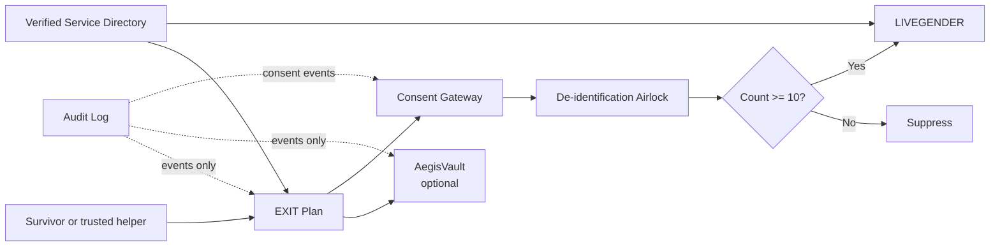
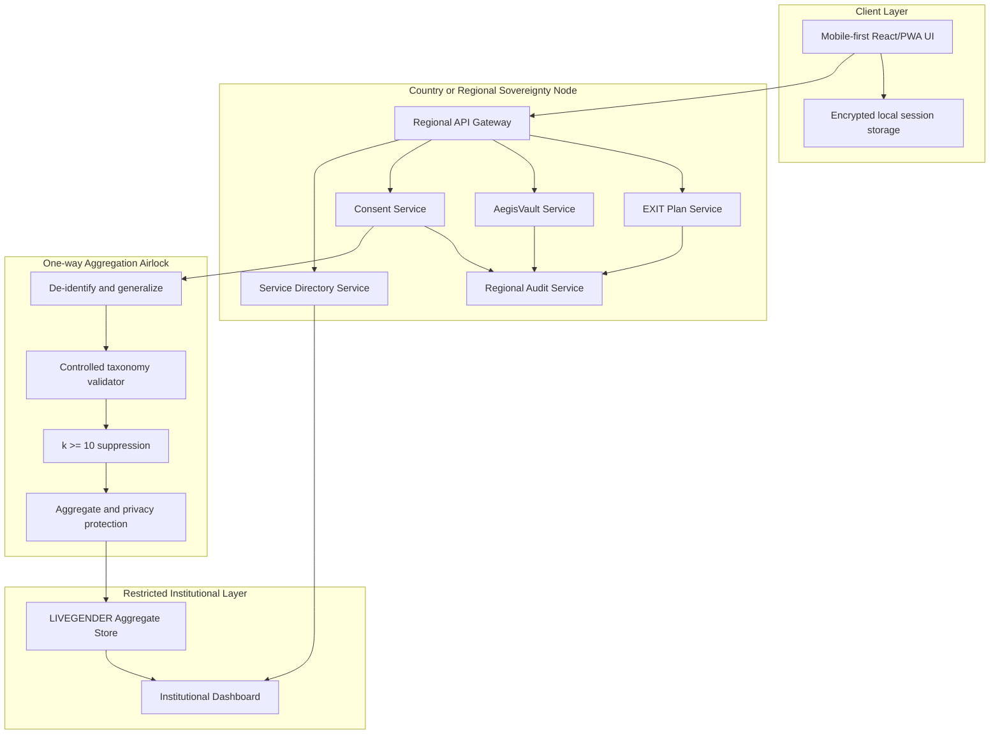

# architecture.md

# EXIT — System Architecture

**Version:** 1.0

**Status:** Hackathon MVP architecture

## 1. Architecture Principles

EXIT is designed as a privacy-first, survivor-centred platform with three strictly separated product modules: EXIT Plan, AegisVault, and LIVEGENDER. The central architectural rule is that private survivor data must never become observatory data.

The architecture uses module-separated stores, region-local personal-data services, independent encryption domains, opaque module-local identifiers, a one-directional aggregation airlock, and a separate audit log. The design intentionally avoids a central identity graph and avoids peer-to-peer or blockchain replication of personal records because survivor data must remain deletable.

## 2. End-to-End Application Flow



The user starts in EXIT Plan. The user may remain entirely local and private. The user may optionally use AegisVault for evidence continuity. Only a separate explicit consent action can create an approved contribution to the aggregation airlock. The airlock strips identifiers, generalizes geography and time, validates taxonomy, applies k ≥ 10 suppression, and emits aggregate data to LIVEGENDER.

## 3. Overall System Architecture



## 4. Module Separation

| Module | Owns | Does not access |
|---|---|---|
| EXIT Plan | Needs, readiness statuses, action plan, simulator inputs | Evidence content, observatory identities |
| AegisVault | Encrypted evidence objects, hashes, timeline, grants | LIVEGENDER, public dashboard, unrelated users |
| Consent Gateway | Consent versions, selected fields, withdrawal state | Private evidence content |
| Service Directory | Verified support-resource records | Survivor plans or evidence |
| LIVEGENDER | De-identified, threshold-protected aggregates | Names, exact locations, private plans, evidence, user IDs |
| Audit Log | Security and governance events | Personal content and evidence bytes |

Each module must have a separate service boundary, database or storage boundary, service identity, encryption domain, and access policy.

## 5. Frontend and Backend Overview

### Frontend

The frontend is a mobile-first progressive web application. React with TypeScript and Tailwind CSS is the recommended hackathon implementation, although the architecture remains framework-flexible. The frontend provides local-only operation, low-data mode, quiet mode, quick exit, accessibility controls, internationalization, and user-visible privacy explanations.

### Backend

The backend exposes regional REST services. Java Spring Boot is the recommended implementation from the project brief, with Spring Security, role-based access control, consent services, directory services, evidence metadata services, aggregation services, and append-only audit events. Equivalent technologies may be used if they preserve the same boundaries and guarantees.

## 6. Suggested Folder Structure

```text
exit/
├── apps/
│   ├── web-client/
│   │   ├── src/
│   │   │   ├── components/
│   │   │   ├── features/
│   │   │   │   ├── exit-plan/
│   │   │   │   ├── aegis-vault/
│   │   │   │   ├── consent/
│   │   │   │   ├── directory/
│   │   │   │   └── livegender/
│   │   │   ├── routes/
│   │   │   ├── i18n/
│   │   │   ├── security/
│   │   │   └── styles/
│   │   └── public/
│   └── demo-api/
├── services/
│   ├── plan-service/
│   ├── vault-service/
│   ├── consent-service/
│   ├── directory-service/
│   ├── airlock-service/
│   ├── observatory-service/
│   └── audit-service/
├── packages/
│   ├── shared-types/
│   ├── taxonomy/
│   ├── rules-engine/
│   ├── validation/
│   └── security-utils/
├── data/
│   ├── synthetic/
│   ├── directory-seed/
│   └── fixtures/
├── docs/
├── infra/
│   ├── docker-compose.yml
│   ├── migrations/
│   └── deployment/
└── README.md
```

## 7. Service Boundaries

### EXIT Plan Service

Owns onboarding state, selected needs, categorical readiness, rules-engine outputs, simulator scenarios, private checklists, and user deletion requests. It must not write directly to AegisVault or LIVEGENDER.

### AegisVault Service

Owns encrypted object storage, evidence metadata, SHA-256 integrity records, private timelines, sharing grants, revocation, expiry, and evidence export preparation. It must never export directly to LIVEGENDER.

### Consent Service

Owns consent screens, consent versions, accepted fields, withdrawal state, retention policy, and contribution receipts. It is the only service authorized to create a contribution request for the airlock.

### Service Directory Service

Owns support-resource records, verification levels, review dates, languages, accessibility fields, eligibility, safety notes, and disabled states. User suggestions require human verification.

### Airlock Service

Accepts only approved contribution fields. It removes identifiers, generalizes location and time, validates the taxonomy, checks independence, applies k ≥ 10 suppression, and emits aggregates. It must not expose source records or support backward queries.

### LIVEGENDER Observatory Service

Stores and serves only de-identified aggregates. It provides restricted, role-based dashboard queries with provenance, suppression state, synthetic-data labels, quality information, and limitations.

### Audit Service

Stores hash-chained event metadata for upload, view, share, revoke, export, consent, withdrawal, directory verification, and administrative actions. It never stores personal content.

## 8. Conceptual API Interactions

| Interaction | Direction | Rule |
|---|---|---|
| Client to Plan API | Bidirectional | User/session scoped; no central identity graph |
| Client to Vault API | Bidirectional | User-controlled and grant-controlled |
| Client to Consent API | Bidirectional | Default private; explicit field-level choice |
| Directory to Client | Read | Only active, verified resources are visible |
| Consent to Airlock | One-way | Approved fields only |
| Airlock to LIVEGENDER | One-way | Aggregate output only |
| LIVEGENDER to Regional Nodes | Forbidden | No reverse lookup or source query |
| Plan to Vault | No direct server-side join | Client-controlled transition only |
| Vault to LIVEGENDER | Forbidden | Evidence never enters observatory |

## 9. Data Flow

Allowed aggregate input fields include controlled harm category, broad country, safe state/province where thresholds permit, broad city/district, broad week/month, optional broad age band, optional service need, and source provenance.

Forbidden fields include name, phone, email, address, exact GPS, photo, video, audio, screenshot, free-text narrative, social handle, account link, device identifier, IP address, evidence hash, user ID, trusted contact, shelter location, workplace or school, and alleged perpetrator information.

## 10. Security Flow

1. The client establishes a local-only or region-local session.
2. Sensitive traffic uses TLS.
3. Regional services authorize requests using session-bound or role-based credentials.
4. Sensitive content is encrypted at rest using authenticated encryption.
5. Each module uses an independent key hierarchy.
6. Evidence is hashed before storage and verified after authorized retrieval.
7. Sharing uses signed, short-lived, revocable grants.
8. Security events are added to a hash-chained audit log.
9. Deletion invalidates grants and removes or cryptographically destroys the relevant records.
10. The airlock prevents private data from entering LIVEGENDER.

## 11. Hackathon Deployment

The hackathon deployment may run as a Docker Compose stack on one machine while logically preserving the production boundaries. Each service should have a separate container, environment configuration, database schema, and mock encryption key. Synthetic fixtures must be loaded at startup.

| Component | Hackathon implementation |
|---|---|
| Web client | React/PWA development server or static build |
| Regional API | Single backend process with module-separated services |
| Databases | Separate schemas or containers for Plan, Vault, Consent, Directory, Aggregate, Audit |
| Object storage | Local encrypted mock or MinIO-compatible storage |
| Authentication | Demo role login plus local session mode |
| Airlock | Dedicated service or isolated processing module |
| Dashboard | Restricted NGO demo role |
| Data | Fictional Maya scenario and synthetic aggregates |

The prototype must clearly state that production deployment requires regional sovereignty, independent security audits, local safeguarding partners, legal review, reviewed privacy mechanisms, and ongoing threat modelling.

## 12. Availability and Failure Behaviour

If the network is unavailable, EXIT Plan should continue in local-only mode where safe. Uploads and aggregate contributions must not queue silently for later transmission without user awareness. If the airlock is unavailable, no raw contribution should be stored in LIVEGENDER. If a directory resource is expired or unverifiable, it must be hidden or marked unavailable rather than silently shown as active.

## 13. References

[1]: `/home/ubuntu/upload/EXIT_Prompts(claude).pdf` — *EXIT Prompts (Claude): Survivor-Owned Safety Continuity Platform*.
[2]: `/home/ubuntu/upload/pasted_content_2.txt` — *EXIT Documentation Generation Instructions*.
